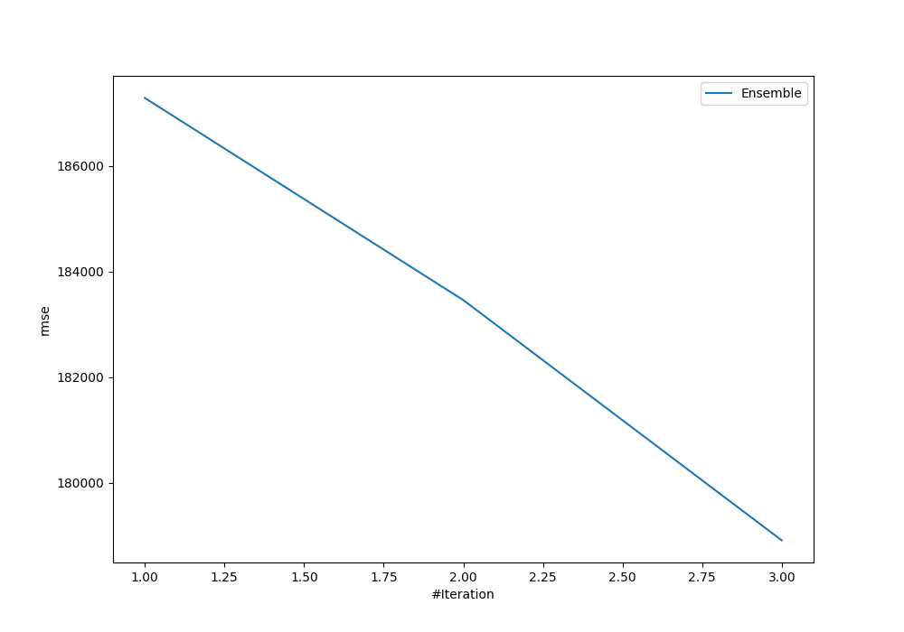
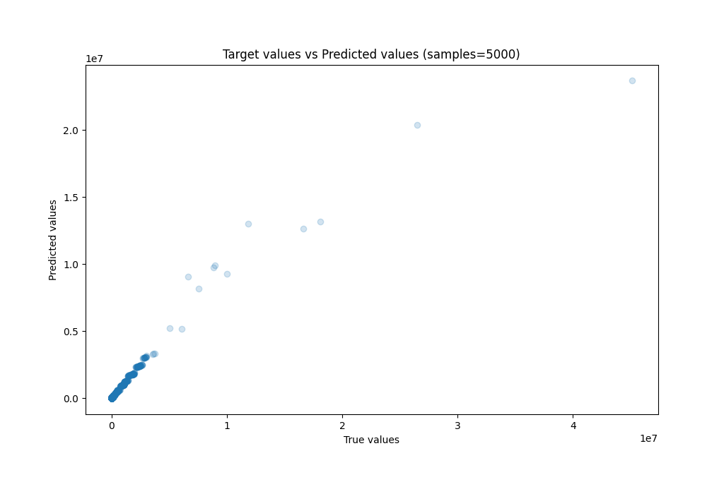
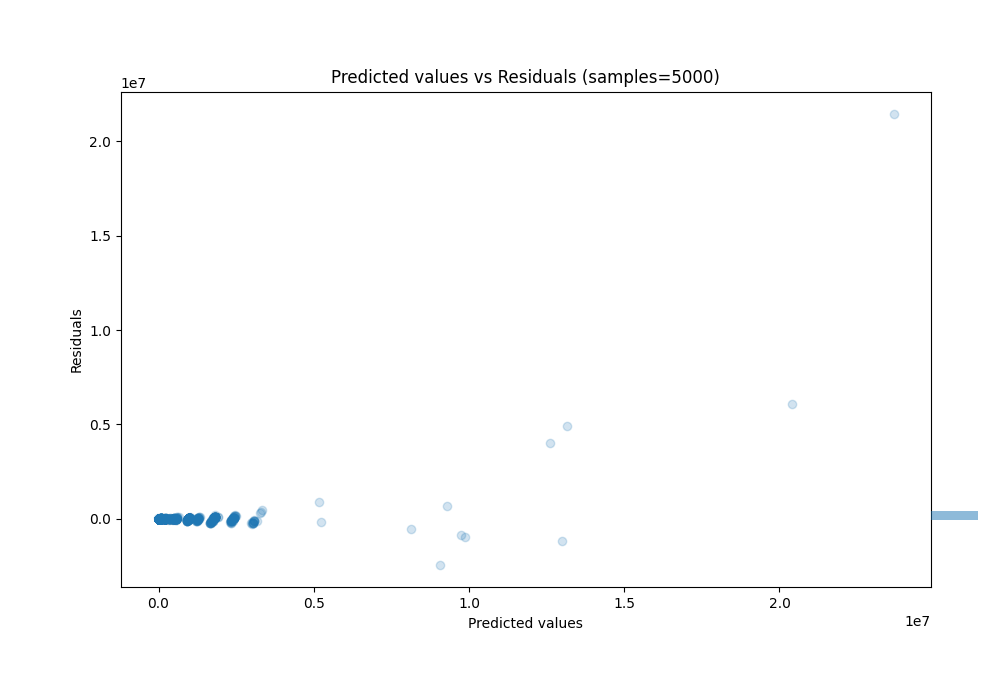

# Summary of Ensemble

[<< Go back](../README.md)

## Ensemble structure
| Model             |   Weight |
|:------------------|---------:|
| 1_DecisionTree    |        2 |
| 2_Default_Xgboost |        1 |

### Metric details:
| Metric   |            Score |
|:---------|-----------------:|
| MAE      |  14520.8         |
| MSE      |      3.20091e+10 |
| RMSE     | 178911           |
| R2       |      0.949813    |
| MAPE     |      3.21294e+18 |

## Learning curves

## True vs Predicted

## Predicted vs Residuals

[<< Go back](../README.md)
