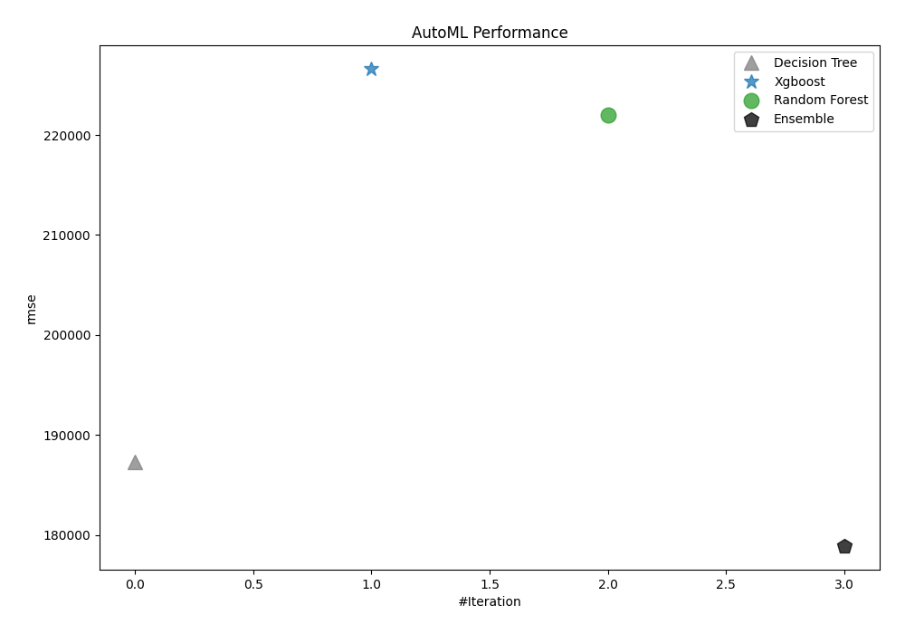
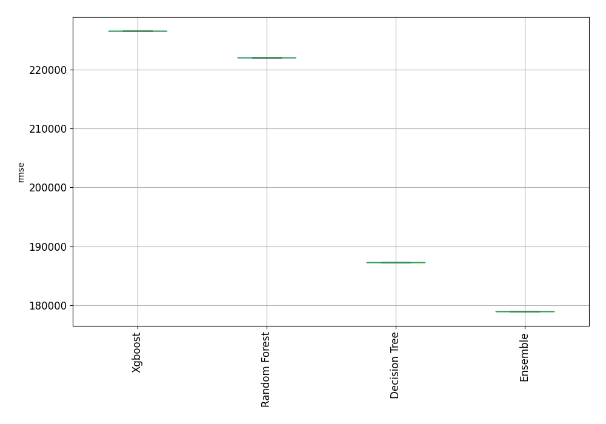
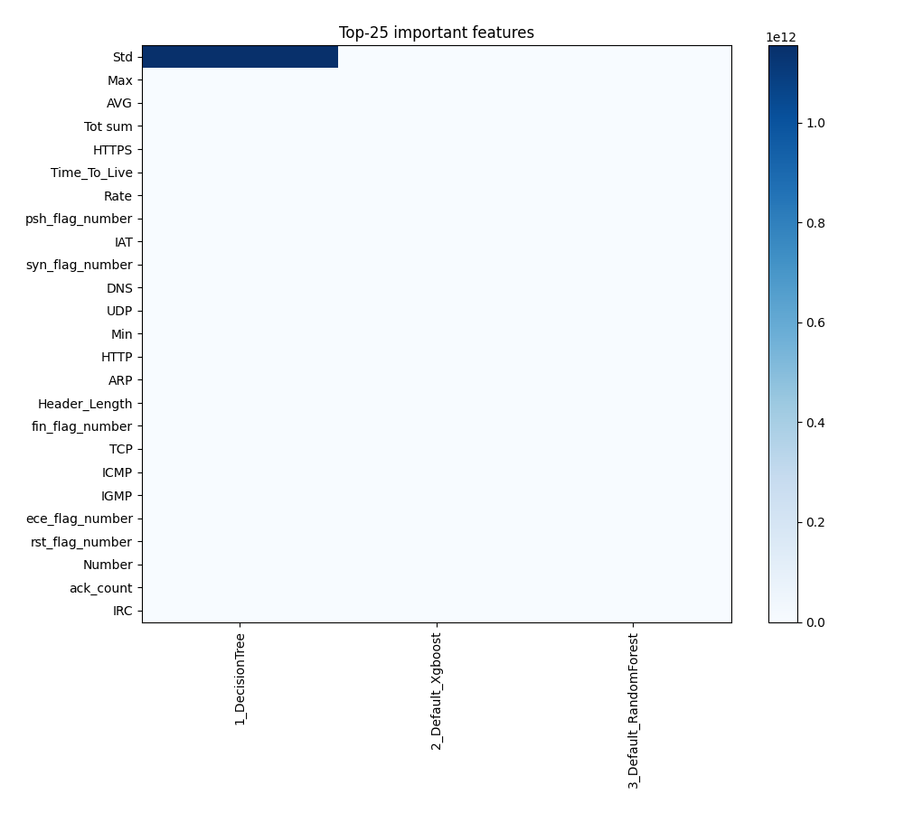
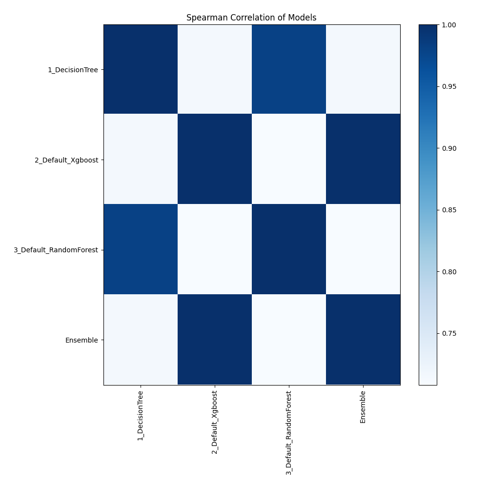

# AutoML Leaderboard

| Best model   | name                                                       | model_type    | metric_type   |   metric_value |   train_time |
|:-------------|:-----------------------------------------------------------|:--------------|:--------------|---------------:|-------------:|
|              | [1_DecisionTree](1_DecisionTree/README.md)                 | Decision Tree | rmse          |         187291 |        12.59 |
|              | [2_Default_Xgboost](2_Default_Xgboost/README.md)           | Xgboost       | rmse          |         226582 |        27.62 |
|              | [3_Default_RandomForest](3_Default_RandomForest/README.md) | Random Forest | rmse          |         222001 |        18.35 |
| **the best** | [Ensemble](Ensemble/README.md)                             | Ensemble      | rmse          |         178911 |         0.25 |

### AutoML Performance

### AutoML Performance Boxplot

### Features Importance

### Spearman Correlation of Models

